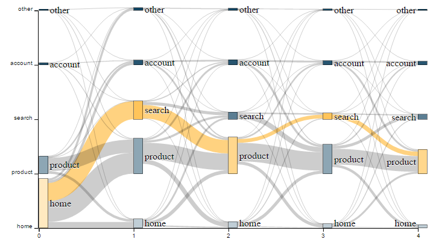

# d3-sankeyseq



d3-sankeySeq.js is an adaptation of the [sankey plugin](https://github.com/d3/d3-sankey) for sequential data. Unlike the standard sankey diagram, where the position of the nodes are determined
by an iterative procedure, sankeySeq is suitable for sequential data for a given sequence (e.g. time sequence) where the node positions are fixed. 

[Here](https://github.com/EE2dev/sequence-explorer) is an example how to use it.

## Installing

If you use NPM, `npm install d3-sankeyseq`. 

## API Reference

```html
<script>
var sankeySeq = d3.sankeySeq();
</script>
```

function | parameter | explanation
------------ | -------|------
`debugOn()` | *boolean* | e.g. `sankeySeq.debug(true)` turns on/off the console.log debugging. The default setting is false.
`size()` | *2-dim array* |, e.g. `sankeySeq.size([600, 400])` sets size of the SVG based on an array [width, height]. The default size is [700, 500].
`margin()` | *integer* | e.g. `sankeySeq.margin(10)` sets margin in pixels for top, right, bottom, left. The default margin is 0 px.
`sequence()` | *array* | e.g. `sankeySeq.sequence(["2000", "2001", "2002"])` sets the order of the sequence based on an array. The default order is ascending.
`categories()` | *array* | e.g. `sankeySeq.categories(["A", "B", "C"])` sets the order of the categories based on an array. The default order is ascending.
`sequenceName()` | *string* | e.g. `sankeySeq.sequenceName("year")` sets the name of the x axis. The default name is "sequence".
`categoryName()` | *string* | e.g. `sankeySeq.categoryName("state")` sets the name of the y axis. The default name is "category".
`valueName()` | *string* | e.g. `sankeySeq.valueName("frequency")` sets the name of the value. The default name is "value".
`nodeWidth()` | *integer* | e.g. `sankeySeq.nodeWidth(20)` sets the width of a node in pixels. The default width is 15.
`nodePadding()` | *integer* | e.g. `sankeySeq.nodePadding(10)` sets the y-padding between the categories in pixels. The default padding is 8.
`nodes()` | *array* | e.g. `sankeySeq.nodes([{"node":0,"name":"node0"},{"node":1,"name":"node1"}])` sets the list of nodes to the specified function or array. The default is [].
`links()` | *array* | e.g. `sankeySeq.links([{"source":0,"target":2,"value":2},{"source":1,"target":2,"value":2}])` sets the list of links to the specified function or array. The default is [].
`maxValue()` | *integer* | e.g. `sankeySeq.maxValue(100)` sets the reference nodeHeight in pixels for computing the vertical scaling factor. The default is the node height of the node with the largest value.

-----------------------
